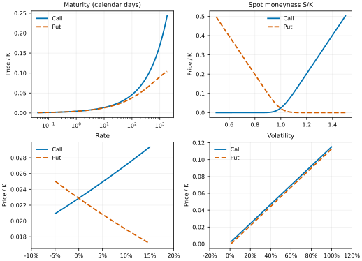
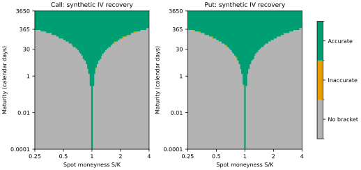

# W3-03 Black--Scholes Sensitivity and Numerical Stability

This is a deterministic, synthetic Track A analysis of one European
Black--Scholes option. It neither uses market data nor treats a single-option
implied volatility as VIX. VIX remains the model-free SPX option-strip index,
and `IVAR = (VIX / 100)^2` remains the locked Track B variance quantity.

## Compact sensitivity plots

The four panels vary one input at a time around `S = K = 100`,
`T = 30/365`, `r = 3%`, `sigma = 20%`, and `q = 0`. Prices are divided by
strike. Moneyness means spot moneyness `S/K`. The plots show the expected
call/put asymmetry: calls rise and puts fall with `S/K`; calls rise and puts
fall with the rate in this no-dividend comparison; and both option values rise
with volatility. Maturity effects combine time value and discounting, so they
are displayed rather than summarized as universally monotone.

The recovery map holds `r = 3%` and `sigma = 20%` fixed while varying
maturity and `S/K`. Green cells recover sigma within
`max(1e-8, 1e-6 * sigma)`; grey cells return the solver's explicit
`no_bracket` diagnostic. The map is descriptive of float64 computation and
the documented solver tolerances, not an economic admissibility map.

## Full-factorial stability audit

The audit crosses 10 maturities from
`1e-08` to `30` years,
16 values of `S/K` from
`0.01` to `100`,
5 rates from `-10%` to
`20%`, 8 volatilities from
`0.0001` to `20`, and calls and
puts: 12,800 cases in total. Synthetic prices are inverted using the
production Brent solver.

| Outcome | Cases | Share |
|---|---:|---:|
| Accurate IV recovery | 4,998 | 39.0% |
| Explicit `no_bracket` | 7,794 | 60.9% |
| Converged but inaccurate at the stated tolerance | 8 | 0.1% |

All 12,800 prices are finite and inside their analytical call/put bounds.
Among the 5,006 converged inversions, the maximum absolute IV
error is `1.738e-05` and the maximum relative IV error is
`3.475e-06`. These maxima are stress-test diagnostics, not typical
market-quote accuracy.

### Failure regions by maturity

| Value | Cases | Accurate | No bracket | Inaccurate |
|---:|---:|---:|---:|---:|
| 3.65e-06 d | 1280 | 6.2% | 93.8% | 0 |
| 0.000365 d | 1280 | 9.8% | 89.8% | 5 |
| 0.037 d | 1280 | 22.2% | 77.8% | 0 |
| 1 d | 1280 | 36.9% | 63.1% | 0 |
| 7 d | 1280 | 47.7% | 52.2% | 1 |
| 30 d | 1280 | 54.4% | 45.6% | 0 |
| 91 d | 1280 | 60.2% | 39.8% | 0 |
| 1 y | 1280 | 52.5% | 47.5% | 0 |
| 5 y | 1280 | 56.1% | 43.8% | 2 |
| 30 y | 1280 | 44.5% | 55.5% | 0 |

### Failure regions by moneyness

| Value | Cases | Accurate | No bracket | Inaccurate |
|---:|---:|---:|---:|---:|
| S/K <= 0.50 | 3200 | 27.3% | 72.7% | 1 |
| 0.50 < S/K < 0.90 | 800 | 40.5% | 59.5% | 0 |
| 0.90 <= S/K <= 1.10 | 4000 | 57.6% | 42.3% | 5 |
| 1.10 < S/K < 2.00 | 1600 | 39.6% | 60.4% | 0 |
| S/K >= 2.00 | 3200 | 27.0% | 72.9% | 2 |

### Failure regions by rate

| Value | Cases | Accurate | No bracket | Inaccurate |
|---:|---:|---:|---:|---:|
| -10% | 2560 | 38.3% | 61.6% | 1 |
| -2% | 2560 | 39.8% | 60.2% | 1 |
| 0% | 2560 | 40.7% | 59.1% | 3 |
| 5% | 2560 | 39.2% | 60.8% | 1 |
| 20% | 2560 | 37.2% | 62.7% | 2 |

### Failure regions by volatility

| Value | Cases | Accurate | No bracket | Inaccurate |
|---:|---:|---:|---:|---:|
| 0.01% | 1600 | 2.4% | 97.6% | 0 |
| 1% | 1600 | 9.0% | 91.0% | 0 |
| 5% | 1600 | 23.1% | 76.8% | 2 |
| 20% | 1600 | 40.8% | 59.2% | 0 |
| 80% | 1600 | 59.3% | 40.6% | 1 |
| 200% | 1600 | 65.6% | 34.4% | 0 |
| 500% | 1600 | 62.2% | 37.5% | 5 |
| 2000% | 1600 | 50.0% | 50.0% | 0 |

## Numerical interpretation

Of the 7,794 explicit failures,
7,154 occur because the computed option
price is at or within the solver tolerance of its lower no-arbitrage bound,
and 640 occur at the upper bound.
None of the synthetic failures is a price-bound violation or an unreported
solver exception.

The common mechanism is weak identification. Black--Scholes vega tends to
zero for very short maturity, extreme moneyness, very low volatility, and
prices close to an upper bound at very high total volatility. In those
regions, distinct volatilities map to prices that are identical or nearly
identical in float64 arithmetic. A root is therefore not numerically
identified even though the exact mathematical price is monotone in
volatility. Interest rates shift forward moneyness and the discounted bounds;
their effect on failure frequency is consequently smaller and non-monotone in
this symmetric stress grid.

The 8 converged cases outside the stated recovery tolerance
are:

| T | S/K | r | True sigma | Type | Recovered sigma | Abs. error |
|---:|---:|---:|---:|---:|---:|---:|
| 0.000365 d | 1.03 | -10% | 500% | call | 4.99999496 | 5.041e-06 |
| 0.000365 d | 1.03 | -2% | 500% | call | 4.99999457 | 5.426e-06 |
| 0.000365 d | 1.03 | 0% | 500% | call | 4.99999464 | 5.361e-06 |
| 0.000365 d | 1.03 | 5% | 500% | call | 5.00001738 | 1.738e-05 |
| 0.000365 d | 1.03 | 20% | 500% | call | 4.99999366 | 6.342e-06 |
| 7 d | 2 | 20% | 80% | call | 0.800001158 | 1.158e-06 |
| 5 y | 0.5 | 0% | 5% | put | 0.0500000558 | 5.585e-08 |
| 5 y | 2 | 0% | 5% | call | 0.0500000558 | 5.585e-08 |

These cases reprice successfully but show why a tiny price residual alone is
not a reliable IV-accuracy criterion when vega is close to zero.

## Operational safeguards

1. Check the discounted European price bounds before inversion and preserve
   the solver's stable diagnostic code.
2. Do not convert `no_bracket` into zero volatility, a cap value, or a missing
   value without retaining the reason.
3. Prefer the out-of-the-money side of a parity-linked quote when possible to
   reduce subtraction of intrinsic value, while still checking quote quality.
4. Treat very small vega as an identification warning. For real quotes,
   bid--ask width and tick size dominate machine precision.
5. Report the positive search interval and cap. A quote beyond the cap is a
   documented failure, not permission to enlarge the cap after seeing a
   desired result.

## Scope and reproduction

This self-inversion audit tests numerical conditioning, not Black--Scholes
model fit or independent formula correctness; W3-02 supplies the independent
QuantLib and limited real-quote checks. The extreme grid deliberately includes
inputs far outside ordinary SPX use, so its aggregate failure share is not an
estimate of market-data failure frequency.

Run `vrp-option-sensitivity --output-dir docs/figures --report
docs/w3_03_numerical_sensitivity.md` to regenerate both SVG figures and this
note. No raw or provider market dataset is read.
